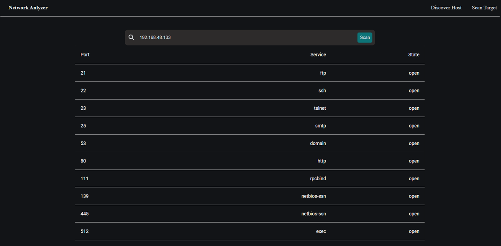
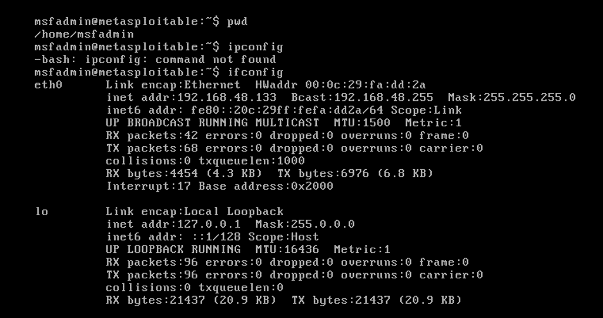

# Network Analyzer using NMap

The Network Analyzer is a web-based application designed to facilitate comprehensive network analysis. By integrating Flask and Nmap, it provides functionalities for scanning devices on a local network, retrieving detailed IP information, and inspecting specific network targets for open ports and services. The application offers a user-friendly web interface, allowing seamless interaction for network administrators and users.

## Key Features

### Device Discovery:

- **Lists all devices connected to the local network**: This feature scans the network to identify all active devices.
- **Provides details such as IP addresses, MAC addresses, and vendor information**: For each discovered device, the application retrieves and displays its IP address, MAC address, and vendor information, giving users comprehensive visibility into their network.

### IP Information Retrieval:

- **Displays both public and private IP addresses of the host machine**: The application retrieves and displays the host machine's public IP address (using an external service) and private IP address.
- **Retrieves the hostname of the host**: In addition to IP addresses, the application also retrieves and displays the hostname of the host machine.

### Targeted Scanning:

- **Performs in-depth scans on specified IP addresses**: Users can specify an IP address to scan, and the application will conduct a detailed analysis of that target.
- **Identifies open ports and the services running on them**: For the specified target, the application identifies open ports and the corresponding services, providing valuable information for network security assessment.

## Technology Stack

### Backend:

- **Flask**: A micro web framework for Python used to create the server and handle HTTP requests and responses.
- **Nmap**: A powerful network scanning tool integrated with Flask to perform various network scanning tasks.

### Frontend:

- **React**: A popular JavaScript library for building user interfaces, used to create a dynamic and responsive frontend for the application.

### Libraries and Tools:

- **Socket**: For retrieving the hostname and private IP address.
- **Requests**: For making HTTP requests to external services to obtain public IP addresses.
- **ipaddress**: For handling and manipulating IP address information.

# Preview of the Application

# Experimental Setup with Metasploitable

For experimental purposes, the application can be used with Metasploitable, a vulnerable virtual machine intended for testing and training in cybersecurity. Metasploitable provides a controlled environment for practicing network scanning and vulnerability assessment. Scanning secured systems may be challenging due to various security measures in place. However, techniques like packet fragmentation can be employed to bypass certain firewall rules and other security mechanisms.

